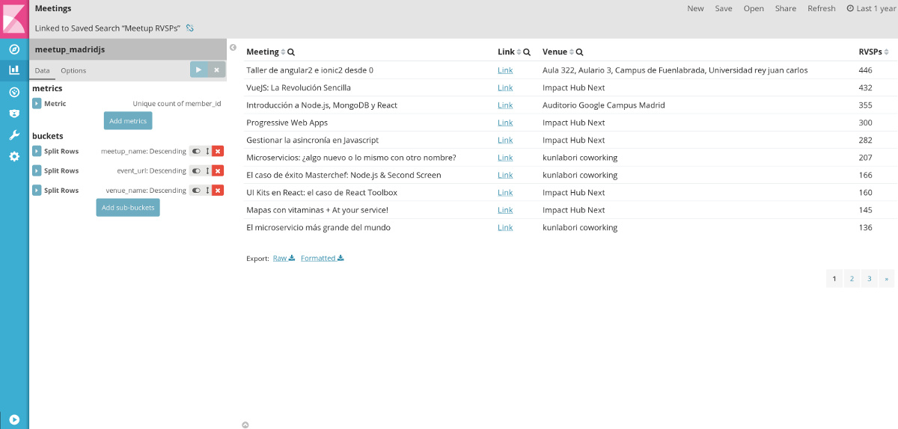
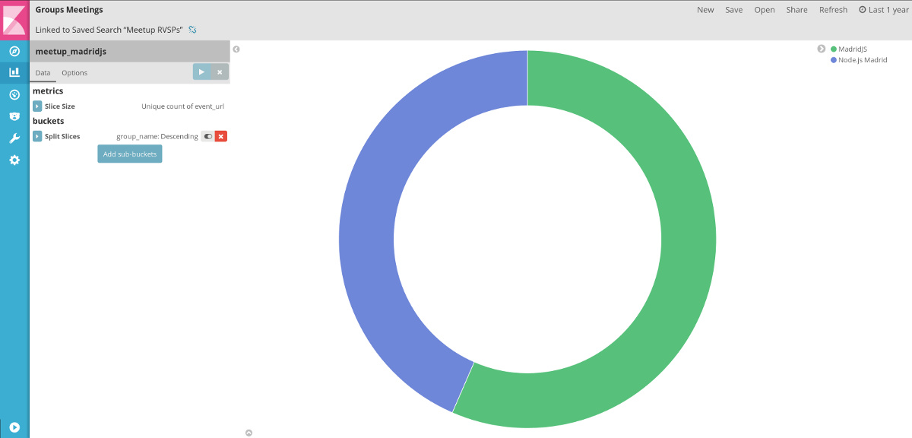

# Analyzing Meetup groups activity

[Meetup](http://meetup.com) is one of the platforms used by many communities (not only technical ones), to organize meetings 
where people can share kwnoledge, experiences, learn new things, etc.

The platform already includes some stats for group managers:


Meetup support has been recently added to [Perceval](http://github.com/grimoirelab/perceval), so let's see
what it could be done with it. What about trying [Grimoire Lab](http://grimoirelab.github.io) to get more *actionable* information?


## Installing Grimoire Lab

There are several ways to start using Grimoire Lab, but let's start from one of the simplest ones, *pip packages* 
and Python virtual environments. Assuming you have already Python 3.x installed:

```bash
$ pyvenv ~/venvs/grimoire
$ source ~/venvs/grimoire/bin/activate
(grimoire) $ pip3 install perceval
(grimoire) $ pip3 install grimoire-elk
```

You would need to have access to an ElasticSearch (ES) and a Kibana instance. Assuming you have them running in your 
computer/laptop under their *default* configuration, you would have ES listening in `http://localhost:9200` and Kibana
in `http://localshot:5601`.

It's time to start loading data to ES!

## Gathering Meetup groups data

To gather data you would need two things:

* Meetup group/s name/s to track (`GROUPNAME`)
* Your [Meetup API Key](https://secure.meetup.com/es-ES/meetup_api/key/): `KEY`

Once you have them, for each `groupname` you execute:

```bash
(grimoire) $ p2o.py --enrich --index meetup_raw --index-enrich meetup \
-e http://localhost:9200 --no_inc --debug meetup GROUPNAME -t KEY --tag GROUPNAME
```

It will be loading data for a while. It produces:

* A *raw* ES index called `meetup_raw`
* An *enriched* ES index called `meetup` (the one we will play with)

## Building a dashboard

Let's open our Kibana instance at `http://localhost:5601`

We need to set up a new `Index pattern` from `meetup` using `grimoire_creation_date` as `Time-field name`.

Once setted up, let's visit the `Discovery` section in Kibana to see how data looks like. We see that Perceval is tracking
several types of information from Meetup. To check RVSP related info we need to create a search and store it.

1. Search for `is_meetup_rvsp=1`
2. Save it as `Meetup RVSPs`

Let's create some visualizations in the `Visualize` section of our Kibana. All of them will be done from 
the saved search `Meetup RVSPs`.

### Simple metrics

Create a `Metric` visualization using to get active members (people who have *RVSP'ed*) and meetings. You would need:

* To get active members:
```
Aggregation: Unique Count
Field: member_id
Custom Label: Active members
```

* To get meeting, add metrics:
```
Aggregation: Unique Count
Field: event_url
Custom Label: Meetings
```

### Some tables

Let's create a *members table* to see:


Using similar techniques, we might create a *meetings table*:



### RVSPs answers

RVSP might be "yes", "no" or you might be in a "waitlist".. Let's create a *pie chart* to show and allow filtering by response.

If you are tracking more than one Meetup group, you might need a pie chart or a table to allow filtering. Something like:



### Evolutionary charts

### Some *painless*

### Create the dashboard

In Kibana `Dashboard` section, add the previous visualization to get something similar to this:


You can save it and play with it to drill down into details, like:

- Who is RVSP'ing the most?
- Which groups are more active?
- Where are meetups happening?
- Who is saying 'No' most of the times to meetup calls?
